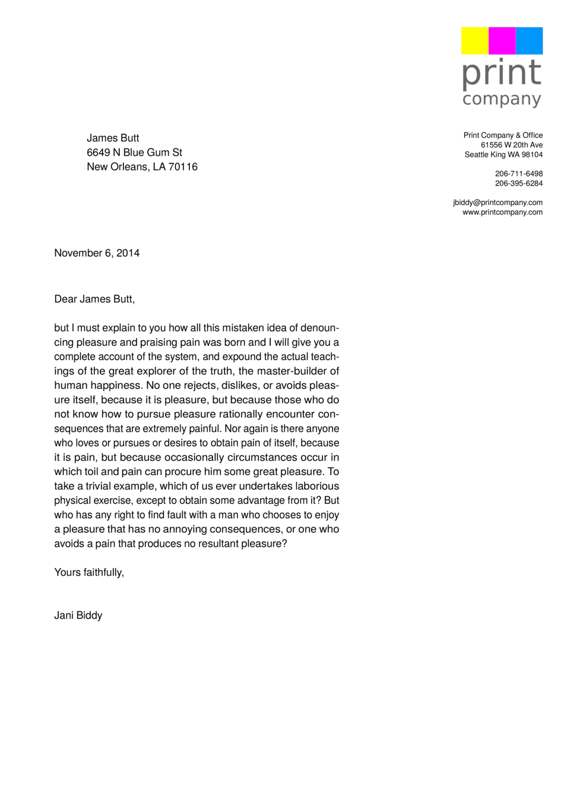
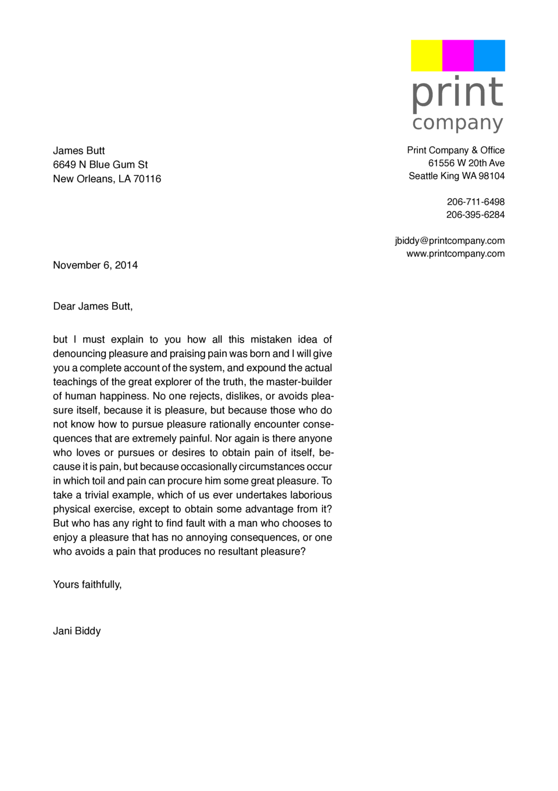
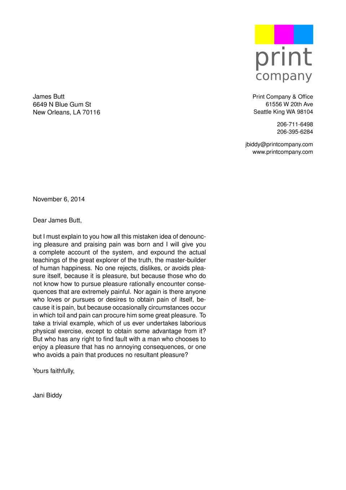
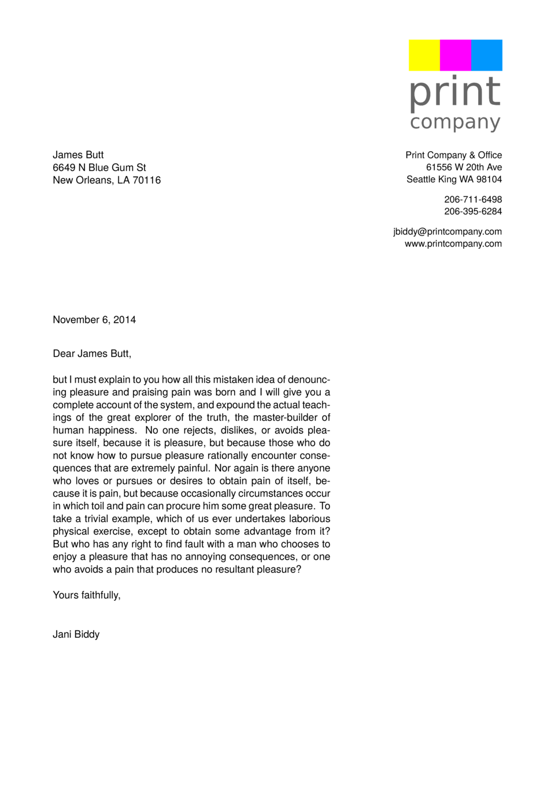
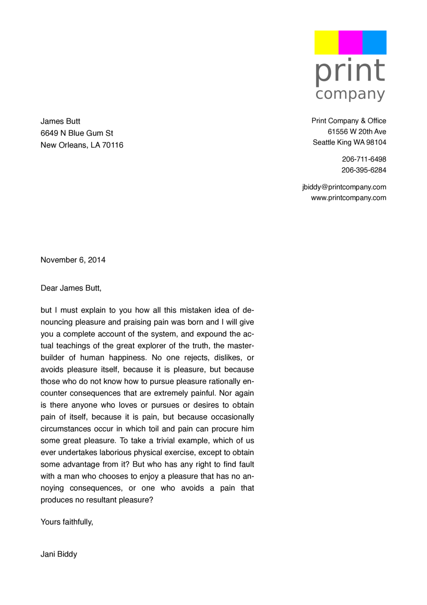

# Typesetting Benchmark

A benchmark comparing six PDF typesetting engines on a simple mail merge task.

Each tool gets the same XML data (name, address) and produces the same letter layout: logo top-right, sender info on the right, recipient on the left, body text at 105mm width with hyphenation.

## Tools

| Tool | Template | Runner |
|------|----------|--------|
| [speedata Publisher](https://www.speedata.de) (sp) | `mailmergesp.xml` | `run_sp.sh` |
| [Typst](https://typst.app) | `mailmerge.typ` | `run_typst.sh` |
| [pdflatex](https://www.tug.org/applications/pdftex/) | `mailmerge_template.tex` + `mailmerge_latex.py` | `run_latex.sh` |
| [LuaLaTeX](https://www.luatex.org) | `mailmerge_template_lualatex.tex` + `mailmerge_lualatex.py` | `run_lualatex.sh` |
| [WeasyPrint](https://weasyprint.org) | `mailmerge_template.html` + `mailmerge_weasy.py` | `run_weasy.sh` |
| [Apache FOP](https://xmlgraphics.apache.org/fop/) | `mailmerge.xsl` | `run_fop.sh` |

## Prerequisites

- [hyperfine](https://github.com/sharkdp/hyperfine) for benchmarking
- Python 3 with Jinja2 and WeasyPrint (`pip install jinja2 weasyprint`)
- pdflatex and lualatex (e.g. via [TeX Live](https://www.tug.org/texlive/))
- [Typst](https://github.com/typst/typst)
- [Apache FOP](https://xmlgraphics.apache.org/fop/)
- [speedata Publisher](https://github.com/speedata/publisher)

## Running

Each `run_*.sh` script accepts `1` or `500` as argument for the number of pages:

```sh
./run_typst.sh 1      # 1 page
./run_typst.sh 500    # 500 pages (generates fakenames_500.xml if needed)
```

Run all benchmarks:

```sh
./benchmark.sh
```

## Results

macBook Air M4 16 GB RAM

```
=== Benchmark: 1 page ===
Benchmark 1: typst
  Time (mean ± σ):     105.7 ms ±   7.4 ms    [User: 70.5 ms, System: 33.8 ms]
  Range (min … max):    99.6 ms … 124.6 ms    23 runs
 
Benchmark 2: pdflatex
  Time (mean ± σ):     329.1 ms ±   5.8 ms    [User: 291.0 ms, System: 33.4 ms]
  Range (min … max):   323.4 ms … 341.3 ms    10 runs
 
Benchmark 3: lualatex
  Time (mean ± σ):     518.6 ms ±   5.7 ms    [User: 462.4 ms, System: 54.0 ms]
  Range (min … max):   511.8 ms … 530.5 ms    10 runs
 
Benchmark 4: weasyprint
  Time (mean ± σ):     335.2 ms ±   4.8 ms    [User: 298.9 ms, System: 34.1 ms]
  Range (min … max):   331.2 ms … 347.5 ms    10 runs
 
Benchmark 5: fop
  Time (mean ± σ):     532.3 ms ±  11.2 ms    [User: 813.9 ms, System: 60.9 ms]
  Range (min … max):   521.1 ms … 560.2 ms    10 runs
 
Benchmark 6: sp
  Time (mean ± σ):      94.5 ms ±   1.7 ms    [User: 74.2 ms, System: 21.8 ms]
  Range (min … max):    92.6 ms … 101.0 ms    31 runs
 
Summary
  sp ran
    1.12 ± 0.08 times faster than typst
    3.48 ± 0.09 times faster than pdflatex
    3.55 ± 0.08 times faster than weasyprint
    5.49 ± 0.12 times faster than lualatex
    5.63 ± 0.16 times faster than fop

=== Benchmark: 500 pages ===
Benchmark 1: typst
  Time (mean ± σ):     156.6 ms ±   2.8 ms    [User: 241.3 ms, System: 66.9 ms]
  Range (min … max):   153.1 ms … 161.2 ms    19 runs
 
Benchmark 2: pdflatex
  Time (mean ± σ):     712.3 ms ±   7.4 ms    [User: 665.0 ms, System: 50.6 ms]
  Range (min … max):   706.0 ms … 722.7 ms    4 runs
 
Benchmark 3: lualatex
  Time (mean ± σ):      2.356 s ±  0.013 s    [User: 2.203 s, System: 0.156 s]
  Range (min … max):    2.343 s …  2.369 s    3 runs
 
Benchmark 4: weasyprint
  Time (mean ± σ):      8.672 s ±  0.015 s    [User: 7.905 s, System: 0.758 s]
  Range (min … max):    8.660 s …  8.689 s    3 runs
 
Benchmark 5: fop
  Time (mean ± σ):      1.607 s ±  0.016 s    [User: 3.969 s, System: 0.129 s]
  Range (min … max):    1.590 s …  1.618 s    3 runs
 
Benchmark 6: sp
  Time (mean ± σ):      4.354 s ±  0.020 s    [User: 4.278 s, System: 0.099 s]
  Range (min … max):    4.335 s …  4.375 s    3 runs
 
Summary
  typst ran
    4.55 ± 0.09 times faster than pdflatex
   10.27 ± 0.21 times faster than fop
   15.04 ± 0.28 times faster than lualatex
   27.80 ± 0.51 times faster than sp
   55.38 ± 0.99 times faster than weasyprint

```

## Output comparison

| speedata Publisher | Typst | pdflatex |
|---|---|---|
|  |  |  |

| LuaLaTeX | WeasyPrint | Apache FOP |
|---|---|---|
|  |  |  |

## Data

- `fakenames.xml` — 1 test record
- `generate_fakenames.py` — generates `fakenames_500.xml` (500 copies of the record)

## Blog post

See `blogpost-draft.md` for a write-up of the results.
